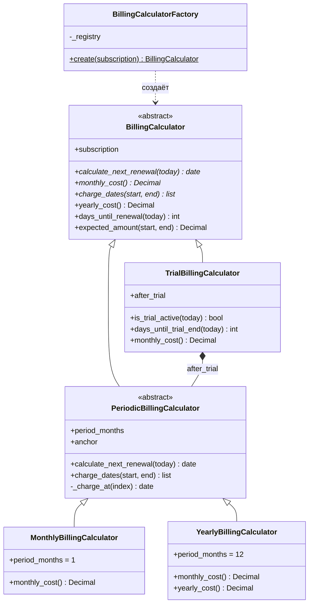
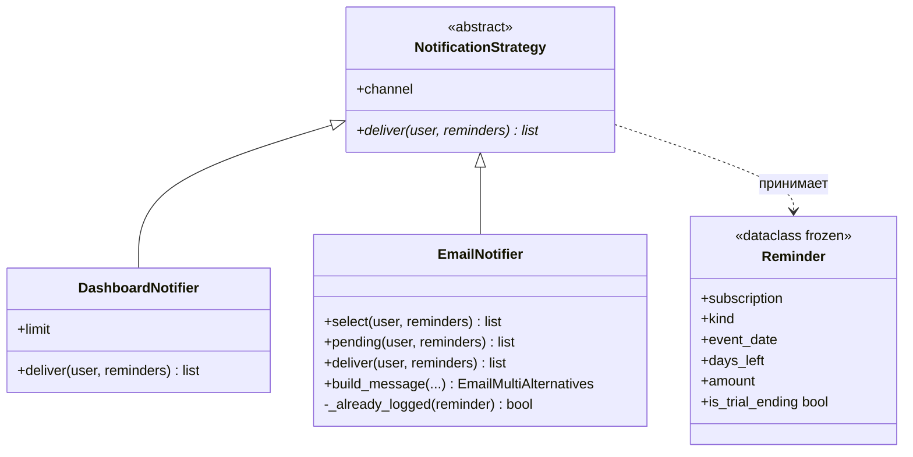
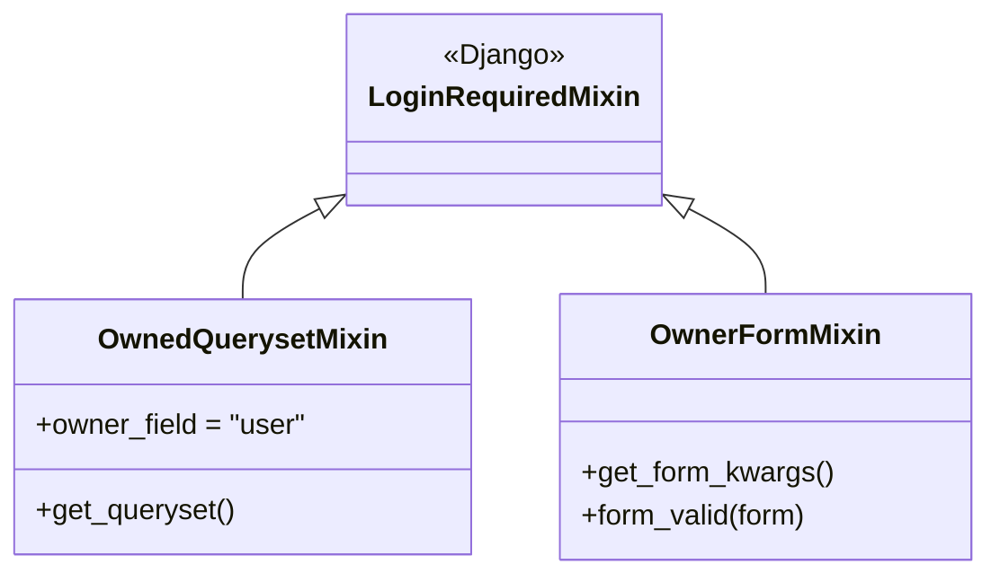

# Архитектура и структура классов

Документ описывает, как устроен код: из каких слоёв состоит, где живёт бизнес-логика
и как в проекте применены наследование, полиморфизм, абстракция и инкапсуляция.
Схема базы данных и авторизация описаны отдельно, в [DATABASE.md](DATABASE.md).

## 1. Слои

```
          HTTP-запрос
               │
        ┌──────▼───────┐   views/     тонкие: достают данные, отдают шаблон
        │  представле- │   forms/     проверка ввода, ограничение выпадающих списков
        │  ния и формы │   mixins.py  изоляция пользователей
        └──────┬───────┘
               │ вызывает
        ┌──────▼───────┐   services/billing.py        расчёт дат и стоимости
        │  сервисный   │   services/notifications.py  кому и как напомнить
        │     слой     │   services/analytics.py      цифры для обзора
        └──────┬───────┘
               │ читает и пишет
        ┌──────▼───────┐   models.py   таблицы, связи, ограничения целостности
        │    модели    │
        └──────────────┘
```

Правило простое: в представлениях нет вычислений, в моделях нет расчётов расходов.
Модель хранит данные и следит за их согласованностью, сервисный слой считает,
представление только собирает результат для шаблона.

Зачем так. Функции сервисного слоя принимают пользователя и дату «сегодня»,
а не запрос. Поэтому их можно вызвать из management-команды и из теста
на фиксированной дате, не поднимая HTTP. Тесты расчётов не трогают ни views,
ни шаблоны.

Приложения:

| Приложение | За что отвечает |
|---|---|
| `core` | базовый шаблон, миксин оформления форм, фильтры `money` и `ru` для шаблонов, тесты настроек сервера |
| `accounts` | регистрация, вход, профиль (`UserProfile`) |
| `subscriptions` | модели предметной области, сервисный слой, CRUD, обзор, команды |
| `config` | настройки, корневые URL, точка входа для gunicorn |

## 2. Иерархия расчётов: наследование и полиморфизм

Главная ООП-часть проекта, файл `subscriptions/services/billing.py`.



### Абстракция

`BillingCalculator` наследует `ABC` и объявляет три метода абстрактными:
`calculate_next_renewal()`, `monthly_cost()`, `charge_dates()`. Создать
`BillingCalculator` напрямую нельзя, Python не даст: класс задаёт договор,
а не поведение. Зато методы `yearly_cost()`, `days_until_renewal()`
и `expected_amount()` реализованы прямо в базовом классе через абстрактные:
наследнику достаточно ответить на три вопроса, и он получает ещё три метода
бесплатно.

### Наследование

`PeriodicBillingCalculator` собирает то общее, что есть у месячной и годовой
подписки: списания идут раз в `period_months` месяцев от опорной даты.
Наследники отличаются ровно двумя вещами: значением `period_months`
и способом посчитать стоимость месяца. `MonthlyBillingCalculator` это три строки,
`YearlyBillingCalculator` четыре.

Отдельно стоит отметить расчёт дат: `k`-е списание считается как
«опорная дата плюс k периодов», а не «предыдущее списание плюс месяц».
Разница видна на подписке от 31 января: при первом способе в феврале спишут
28-го, а в марте снова 31-го; при втором подписка навсегда «уехала» бы на 28-е.

### Полиморфизм

`YearlyBillingCalculator` переопределяет `yearly_cost()`, унаследованный
от базового класса. Причина в округлении: 8 900 / 12 = 741,67, и обратно
741,67 × 12 = 8 900,04. Годовая цена известна точно, поэтому годовой класс
возвращает её напрямую, а остальные считают по общей формуле.

Вызывающий код при этом не меняется. В `analytics.py` месячный итог считается так:

```python
for subscription in subscriptions:
    calculator = BillingCalculatorFactory.create(subscription)
    total += calculator.monthly_cost()
```

Ни одной проверки `if billing_type == ...`. Какой именно класс вернула фабрика,
коду обзора неизвестно и неважно: он знает только интерфейс. Это и есть
полиморфизм в работе, а не в учебном примере.

### Композиция вместо наследования

`TrialBillingCalculator` не наследует периодический калькулятор, а содержит его
в поле `after_trial`. Так задумано: пробный период это не «частный случай
ежемесячной оплаты», а состояние, после которого начинается обычная оплата,
причём любая, месячная или годовая. Наследование здесь описало бы связь неверно,
а композиция позволяет выбрать нужный калькулятор в момент создания:

```python
after_trial_class = self._after_trial_classes[subscription.billing_period_after_trial]
self.after_trial = after_trial_class(subscription, anchor=subscription.trial_end_date)
```

Опорной датой становится конец триала, поэтому первое списание приходится
ровно на день окончания пробного периода, а дальше всё работает само.

### Фабрика

`BillingCalculatorFactory` хранит словарь `_registry`: тип оплаты, класс.
Метод `create()` находит класс по полю `billing_type` и возвращает готовый
объект. Неизвестный тип даёт понятную ошибку, а не падение где-то дальше.

Чтобы добавить квартальную оплату, нужно:

1. добавить значение `QUARTERLY` в `BillingType`;
2. написать класс из трёх строк: `period_months = 3` и `monthly_cost()`;
3. добавить одну строку в `_registry`.

Обзор, уведомления и формы при этом не меняются вовсе. Это тот самый принцип
«открыт для расширения, закрыт для изменения».

### Почему наследование не в базе данных

Django умеет наследование моделей, но в проекте оно сознательно не используется.
Варианты и причина отказа:

| Вариант | Что в базе | Почему не он |
|---|---|---|
| Абстрактная модель | три таблицы, по одной на тип | нельзя выбрать все подписки пользователя одним запросом, каждый отчёт превращается в три запроса и склейку |
| Многотабличное наследование | таблица-родитель плюс три дочерние | любой запрос со всеми полями это JOIN четырёх таблиц, на ER-диаграмме четыре узла вместо одного |
| **Одна таблица плюс классы в Python** | одна таблица | выбран |

Различие типов на уровне данных сводится к одному полю `billing_type`,
а различие поведения вынесено туда, где поведение и живёт, в Python-классы.
База остаётся простой, ООП остаётся честным.

## 3. Уведомления: паттерн «Стратегия»

Файл `subscriptions/services/notifications.py`.



Поиск событий отделён от способа доставки. Функция `collect_reminders(user, today)`
один раз проходит по активным подпискам, спрашивает у калькулятора дату
следующего списания и возвращает список `Reminder`. Дальше стратегия решает,
что с этим списком делать:

- `DashboardNotifier` просто отдаёт напоминания шаблону, ничего не сохраняя:
  обзор перерисовывается при каждом заходе, журнал ему не нужен;
- `EmailNotifier` отбирает только окончания пробного периода в пределах
  «предупреждать за N дней» из профиля, проверяет журнал и отправляет одно
  письмо на пользователя.

Смысл разделения: чтобы добавить, например, отправку в Telegram, нужно написать
третий класс с одним методом `deliver()`. Поиск событий, календарь и обзор
трогать не придётся.

### Как исключены повторные письма

Запись в журнал `NotificationLog` и отправка идут в одной транзакции:

```python
with transaction.atomic():
    for reminder in candidates:
        _, created = NotificationLog.objects.get_or_create(...)
        if created:
            fresh.append(reminder)
    if fresh:
        self.build_message(user, recipient, fresh).send()
```

Уникальный индекс по (подписка, тип, канал, дата события) не даст создать
вторую запись, поэтому повторный запуск команды в тот же день писем не пошлёт.
Если почтовый сервер ответит ошибкой, исключение откатит транзакцию вместе
с записями журнала, и следующий запуск попробует снова, а не «забудет»
напоминание. Порядок именно такой: сначала запись, потом отправка.

## 4. Изоляция пользователей: миксины

Файл `subscriptions/mixins.py`. Требование «пользователь А не видит и не может
изменить данные пользователя Б» выполнено в одном месте, а не проверкой в каждом
представлении.



`OwnedQuerysetMixin` сужает queryset до записей текущего пользователя. Чужой
объект просто не попадает в выборку, и Django отдаёт 404. Именно 404, а не 403:
посторонний не должен узнать даже то, что запись с таким номером существует.

Поле `owner_field` нужно там, где владелец достаётся через связь. У платежа
своего пользователя нет, владелец определяется через подписку, поэтому
`PaymentDeleteView` объявляет `owner_field = 'subscription__user'`.

`OwnerFormMixin` отвечает за запись: передаёт пользователя в форму, чтобы
выпадающие списки карт, тегов и сервисов содержали только свои записи,
и назначает владельца сохраняемому объекту. Поля `user` в форме нет вовсе,
поэтому подменить владельца через подделанный POST-запрос невозможно.

Представления собираются из этих кусков как из деталей:

```python
class SubscriptionUpdateView(OwnedQuerysetMixin, OwnerFormMixin, SuccessMessageMixin, UpdateView):
```

Порядок важен: сначала выборка сужается до своих записей, потом форма получает
пользователя. Это множественное наследование в его нормальном применении,
когда каждый миксин добавляет одну независимую способность.

## 5. Инкапсуляция и вспомогательные вещи

- Внутренние детали спрятаны за подчёркиванием: `_charge_at()`, `_registry`,
  `_already_logged()`, `_after_trial_classes`. Наружу торчит только то,
  что действительно нужно вызывающему коду.
- Вычисляемые значения оформлены свойствами: `Subscription.display_name`,
  `Subscription.category` (категория берётся через сервис, без дублирования поля),
  `UserProfile.effective_email` (почта для уведомлений или, если она не указана,
  почта аккаунта), `SpendingSummary.budget_left`.
- Результаты аналитики это `dataclass`-ы (`SpendingSummary`, `CategorySpending`,
  `MonthPoint`), а не словари. Опечатка в имени поля обнаруживается сразу,
  а в шаблоне видно, что именно доступно.
- `Reminder` объявлен `frozen=True`: напоминание нельзя случайно изменить
  после создания.

## 6. Проверки целостности: три уровня

Одно и то же правило проверяется на разной глубине, и это не дублирование,
а разные рубежи:

| Уровень | Пример | Что ловит |
|---|---|---|
| Форма | подписи, подсказки, ограничение списков своими записями | ошибку человека при вводе |
| `Model.clean()` | у триала обязательна дата окончания; способ оплаты принадлежит тому же пользователю | ошибку кода, который создаёт объект мимо формы |
| Ограничение в базе | `CheckConstraint` на неотрицательную цену, уникальные индексы | любую запись, откуда бы она ни пришла, включая админку и SQL |

Полный список ограничений приведён в [DATABASE.md](DATABASE.md).

## 7. Тесты

278 тестов, запуск: `python manage.py test`.

| Файл | Что проверяет |
|---|---|
| `subscriptions/tests/test_billing.py` | даты списаний, переход через конец месяца, годовой эквивалент, фабрика |
| `subscriptions/tests/test_models.py` | ограничения и `clean()` |
| `subscriptions/tests/test_isolation.py` | пользователь А и данные пользователя Б: 404 на чтение, изменение, удаление |
| `subscriptions/tests/test_dashboard.py` | цифры обзора на фиксированных датах |
| `subscriptions/tests/test_notifications.py` | отбор напоминаний, одно письмо на пользователя, отсутствие повторов |
| `subscriptions/tests/test_security.py` | SQL-инъекции, XSS, подмена заголовков письма, CSRF, ссылки `javascript:`, попытка выдать себе права администратора |
| `subscriptions/tests/test_views_*.py` | CRUD и справочники |
| `accounts/tests.py` | регистрация, вход, профиль |
| `core/tests.py` | настройки для сервера: без секретного ключа запуск запрещён, HTTPS включает защищённые cookie |
