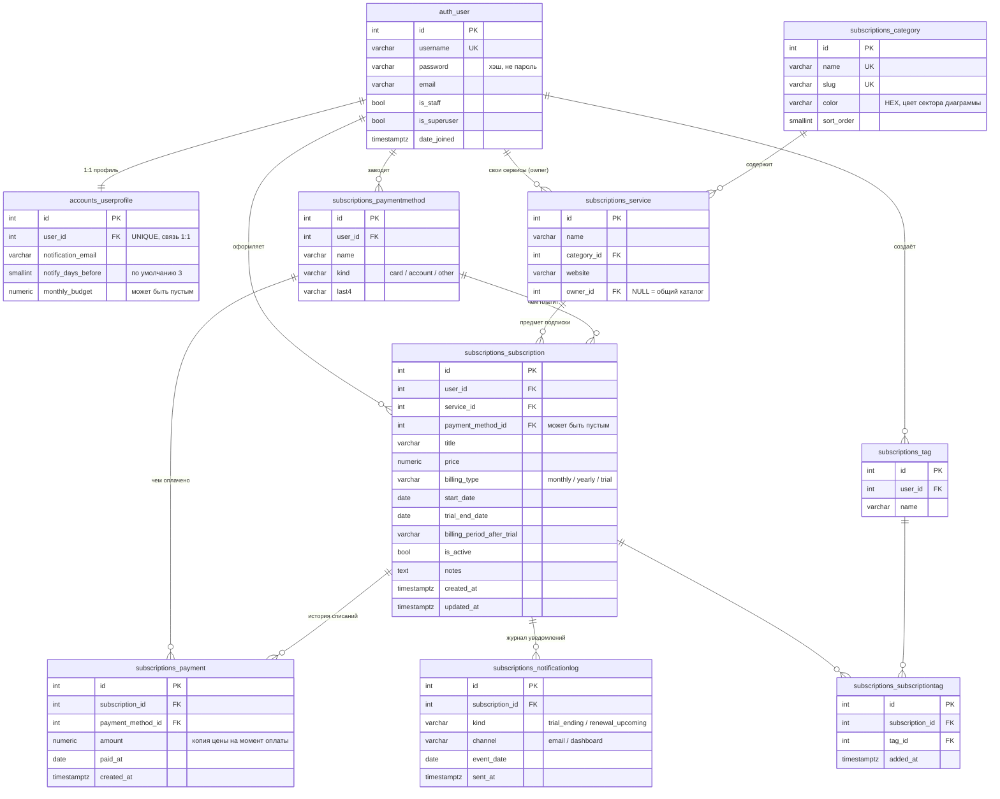

# Структура базы данных и авторизация

Документ описывает схему PostgreSQL, ограничения целостности и то, как устроены
регистрация, вход и разделение данных между пользователями. Структура классов
и бизнес-логика описаны отдельно, в [ARCHITECTURE.md](ARCHITECTURE.md).

## 1. ER-диаграмма

Все типы связей представлены:

| Тип | Пример | Как сделано |
|---|---|---|
| Один к одному | `auth_user` и `accounts_userprofile` | `OneToOneField`, то есть внешний ключ с уникальным индексом |
| Один ко многим | пользователь и его подписки, подписка и её платежи | обычный `ForeignKey` |
| Многие ко многим | подписка и теги | через явную таблицу `subscriptions_subscriptiontag` |
| Транзитивная цепочка | подписка, сервис, категория | категория подписки не хранится, а берётся через сервис |

Почему промежуточная таблица объявлена явно, а не оставлена на усмотрение Django:
в ней есть собственное поле `added_at`, а `clean()` проверяет, что тег и подписка
принадлежат одному пользователю. С автоматической таблицей ни того, ни другого
не сделать.

Почему у подписки нет поля «категория»: она однозначно определяется сервисом.
Хранить её отдельно значит завести второй источник правды, который рано или
поздно разойдётся с первым. Свойство `Subscription.category` просто возвращает
`service.category`.

## 2. Как получить ER-диаграмму из живой базы (DBeaver)

Диаграмма выше написана руками, чтобы её было видно прямо в репозитории.
Картинка из DBeaver строится по реальной схеме и годится для приложения к работе:

1. Запустить базу: `docker compose up -d db`.
2. В DBeaver создать подключение PostgreSQL: хост `localhost`, порт из `.env`
   (локально 5433), база `subtracker`, пользователь и пароль оттуда же.
3. В дереве раскрыть подключение, дойти до схемы `public`.
4. Открыть вкладку `ER Diagram` у схемы. DBeaver построит диаграмму сам.
5. Лишние служебные таблицы Django (`django_migrations`, `django_session`,
   `django_admin_log`, `auth_permission`, `django_content_type`,
   `auth_group_permissions`, `auth_user_user_permissions`) со схемы лучше убрать,
   оставив `auth_user` и таблицы приложений: так видно предметную область,
   а не внутренности фреймворка.
6. Экспорт: правая кнопка по диаграмме, `Export Diagram`, формат PNG.

## 3. Ограничения целостности

Проверки, которые живут в самой базе и потому действуют всегда, откуда бы
ни пришла запись, включая админку и прямой SQL:

| Ограничение | Смысл |
|---|---|
| `subscription_price_non_negative` | цена подписки не может быть отрицательной |
| `payment_amount_non_negative` | то же для суммы платежа |
| `subscription_trial_fields_required` | если тип оплаты `trial`, то обязательно заполнены дата окончания пробного периода и периодичность оплаты после него |
| `unique_catalog_service_name` | в общем каталоге нет двух сервисов с одинаковым названием (условный индекс по `owner IS NULL`) |
| `unique_custom_service_name_per_owner` | у одного пользователя нет двух своих сервисов с одинаковым названием |
| `unique_tag_name_per_user` | теги не повторяются внутри одного пользователя, но разные пользователи могут завести одинаковые |
| `unique_subscription_tag` | один и тот же тег не навесится на подписку дважды |
| `unique_notification_per_event` | по (подписка, тип, канал, дата события) возможна только одна запись: именно это не даёт отправить повторное письмо |

Уникальность названий сервисов описана двумя условными индексами не случайно.
В PostgreSQL `NULL` не равен `NULL`, поэтому обычный индекс по паре
(владелец, название) пропустил бы два каталожных сервиса с одинаковым именем:
у обоих владелец пустой, а значит, для базы это разные строки.

Дополнительные индексы для скорости:

- по (`user_id`, `is_active`) в таблице подписок: обзор и список всегда
  запрашивают активные подписки одного пользователя;
- по (`subscription_id`, `paid_at`) в таблице платежей: график по месяцам
  и история подписки читают платежи в порядке дат.

## 4. Поведение при удалении

| Связь | Правило | Почему |
|---|---|---|
| Пользователь, его подписки, теги, карты, профиль | `CASCADE` | удаление аккаунта уносит все его данные |
| Подписка, её платежи и уведомления | `CASCADE` | история без самой подписки бессмысленна, пользователя об этом предупреждают перед удалением |
| Подписка, сервис | `PROTECT` | сервис из каталога нельзя удалить, пока на него есть подписки |
| Сервис, категория | `PROTECT` | категорию с сервисами не удалить |
| Подписка или платёж, способ оплаты | `SET NULL` | удалённая карта не должна утащить за собой историю расходов, просто пропадёт отметка «чем платили» |

Отдельно про суммы: `Payment.amount` это копия цены на момент оплаты,
а не ссылка на текущую цену подписки. Поэтому повышение цены не переписывает
задним числом историю, и график расходов по месяцам остаётся верным.

## 5. Справочные данные

Категории и стартовый каталог сервисов заполняются миграциями, а не руками:

- `0002_seed_categories_and_services`: семь категорий из технического задания
  и 37 сервисов;
- `0003_update_category_colors`: палитра цветов категорий, проверенная
  на различимость для людей с нарушениями цветовосприятия.

Плюс такого подхода: на новой машине или на сервере база после `migrate` сразу
пригодна к работе, состав справочников описан в репозитории и меняется
отслеживаемо.

## 6. Авторизация и разделение данных

### Что используется

Встроенная система Django `django.contrib.auth`: таблицы `auth_user`,
`django_session`, готовые проверки паролей. Своя модель пользователя
не заводилась, дополнительные поля вынесены в `accounts_userprofile`
со связью один к одному. Профиль создаётся автоматически сигналом
`post_save` (файл `accounts/signals.py`), поэтому он есть у любого
пользователя, откуда бы тот ни появился: из формы регистрации, из админки
или из команды `seed_demo`.

### Как хранится пароль

В поле `auth_user.password` лежит не пароль, а его хэш в формате
`алгоритм$число_итераций$соль$хэш`, по умолчанию PBKDF2 с SHA-256.
Восстановить исходный пароль из этой записи нельзя, при входе сравниваются
хэши. У каждого пользователя своя случайная соль, поэтому одинаковые пароли
дают разные строки в базе.

При регистрации пароль проверяется четырьмя правилами Django: не короче
восьми символов, не только цифры, не из списка распространённых, не похож
на имя пользователя или почту.

### Вход и сессия

1. Форма входа отправляется методом POST вместе с CSRF-токеном.
2. Django находит пользователя и сравнивает хэш пароля.
3. При успехе создаётся запись в `django_session`, а браузеру выдаётся cookie
   с идентификатором сессии. Сам идентификатор в базе хранится в виде хэша.
4. На каждом следующем запросе `AuthenticationMiddleware` по этой cookie
   достаёт пользователя и кладёт его в `request.user`.

Страницы приложения закрыты `LoginRequiredMixin`: анонимного посетителя
перенаправляют на страницу входа. Проверка не пишется в каждом представлении,
она унаследована от миксинов (см. раздел 4 в [ARCHITECTURE.md](ARCHITECTURE.md)).

### Разделение данных между пользователями

Правило «пользователь А не видит и не может изменить данные пользователя Б»
выполняется тремя способами сразу:

| Приём | Где | Что даёт |
|---|---|---|
| Сужение выборки по владельцу | `OwnedQuerysetMixin.get_queryset()` | чужой объект не попадает в выборку, страница отдаёт 404, а не 403: посторонний не узнаёт даже о существовании записи |
| Отсутствие поля владельца в форме | `OwnerFormMixin.form_valid()` | владельца назначает сервер из `request.user`, подделать его через POST нельзя |
| Ограничение выпадающих списков | формы получают `user` | в списках карт, тегов и сервисов только свои записи плюс общий каталог |

Для платежа владелец определяется через подписку: `owner_field = 'subscription__user'`.
Проверка на уровне модели `Subscription.clean()` дополнительно не даёт привязать
к своей подписке чужую карту или чужой сервис.

Всё это покрыто тестами `subscriptions/tests/test_isolation.py`: чтение,
изменение и удаление чужих записей, а также попытка подменить владельца
в POST-запросе.

### Прочие меры защиты

| Мера | Как сделано |
|---|---|
| CSRF | токен во всех формах, изменения только методом POST |
| XSS | автоэкранирование в шаблонах Django, данные для диаграмм передаются через `json_script`, а не подстановкой в JavaScript |
| SQL-инъекции | запросы только через ORM, без ручной сборки SQL |
| Перебор паролей | nginx ограничивает страницы входа и регистрации: не больше 10 запросов в минуту с одного адреса |
| Повышение прав | `is_staff` и `is_superuser` не выводятся ни в одну форму |
| Опасные ссылки | поле сайта сервиса это `URLField`, схемы вроде `javascript:` не проходят проверку |
| Защищённые cookie | при работе по HTTPS cookie сессии и CSRF помечены `Secure`, включены редирект с http и HSTS |
| Секреты | пароли и ключи в `.env`, файл не коммитится; без `DJANGO_SECRET_KEY` сервер с `DEBUG=false` не запускается |

Граничные случаи ввода проверяются в `subscriptions/tests/test_security.py`:
26 тестов, включая попытки SQL-инъекции, вставки скриптов, подмены заголовков
письма и выдачи себе прав администратора.
